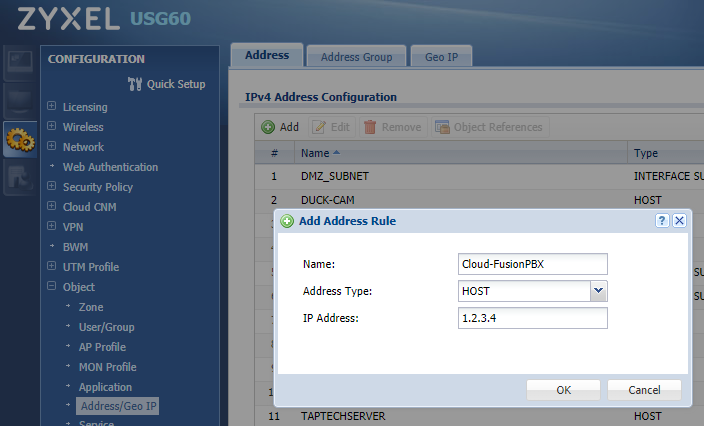
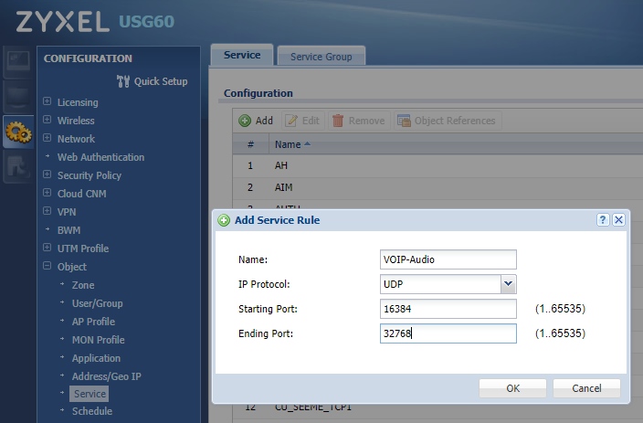
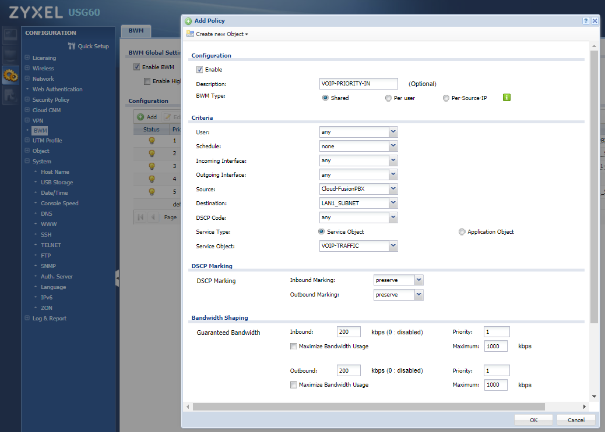

#########
ZyXel
#########

This guide was created using V4.2/4.25 firmware on a ZyXEL USG60 series UTM router.  FusionPBX is in the cloud with a public IP, and the ZyXEL USG60 router is at the customer’s location with the extensions behind it.

 

How to setup Bandwidth Management “BWM” aka QoS
^^^^^^^^^^^^^^^^^^^^^^^^^^^^^^^^^^^^^^^^^^^^^^^^^

There are more than one ways to apply the BWM rules.  They can be applied on a service level, or on an object level, or both.  In this example we will provide traffic priority to traffic between the LAN and the cloud PBX.

 

First, set up an Object for your Cloud PBX.

* Log into the USG and go to Configuration-> Object-> Address/GeoIP

* Click the Add button

Create a name, and enter the static public IP of your FusionPBX.  If you have more than one, such as a failover, add that as well and create a group.

Next, set up a Service Object for the VOIP traffic.

* Go to Configuration-> Object-> Service

* Click the Add button.

Create a name, and set the ports for your traffic.  In this example we will add a Service rule for 5060TCP, 5060UDP, and 16384-32768 UDP.

.. Note:: If you’ve created more than one service object, click the Service Group tab and create a group.  Add the service objects that you’ve created to the group.

Now setup your BWM rules.

* Go to Configuration-> BWM

* Check the Enable BWM box and hit apply.
I’m not sure what affect the “Enable Highest Bandwidth Priority for SIP Traffic” box does, but I leave it unchecked and it works for me!

* Click the Add button and create a Policy for incoming traffic.
Your settings will vary based on your environment.  Priority 1 is the highest priority (what we want) and priority 7 is the lowest priority.

* Click the Add button and create a Policy for outgoing traffic.
Basically will just switch the Source and Destination.

* Click the Apply button.

Zyxel Sip ALG
^^^^^^^^^^^^^^^

This guide was created using V4.2/4.25 firmware on a ZyXEL USG60 series UTM router.

 

How to Disable SIP ALG

                Log into the router and navigate to Configuration -> Network -> ALG

                Uncheck the following to disable SIP ALG:

                                * Enable SIP ALG

                                * Enable SIP Transformations

                                * Enable Configure SIP Inactivity Timeout

                                * Restrict Peer to Peer Signaling Connection

                                * Restrict Peer to Peer Media Connection

Click the Apply button at the bottom of the page.  A reboot should not be necessary, but if you’re still experiencing issues then it is a good idea to try rebooting the router and testing again.

.. image:: ../../_static/images/firewall/fusionpbx_zyxel_usg60.png
        :scale: 85%

