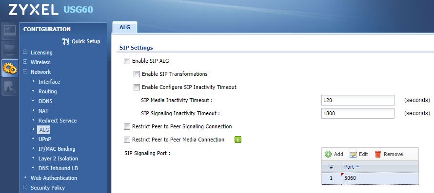

##############
Zyxel Sip ALG
##############

This guide was created using V4.2/4.25 firmware on a ZyXEL USG60 series UTM router.

 

How to Disable SIP ALG

                Log into the router and navigate to Configuration -> Network -> ALG

                Uncheck the following to disable SIP ALG:

                                * Enable SIP ALG

                                * Enable SIP Transformations

                                * Enable Configure SIP Inactivity Timeout

                                * Restrict Peer to Peer Signaling Connection

                                * Restrict Peer to Peer Media Connection

Click the Apply button at the bottom of the page.  A reboot should not be necessary, but if you’re still experiencing issues then it is a good idea to try rebooting the router and testing again.

