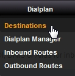
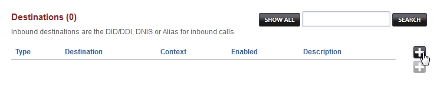
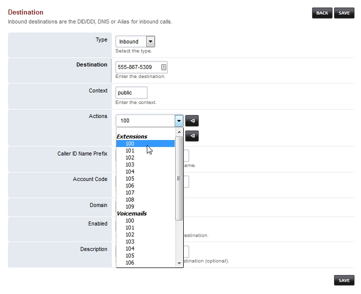
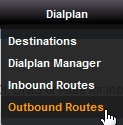

Inbound Destinations
=====================

Inbound destinations are the DID/DDI, DNIS or Alias for inbound calls. `Click here for the youtube video`_

.. raw:: html

    

    <iframe width="100%" height="350" src="https://www.youtube.com/embed/8-EJM0hd-J8?rel=0" frameborder="0" allow="autoplay; encrypted-media" allowfullscreen></iframe>
    

Configure Inbound Destinations: (This will auto-configure an Inbound Route also)

*Select* **Dialplan** from the drop-down list and then *click* **Destinations**. 

Click on the

.. image:: ../_static/images/plus.png
        :scale: 85%

button on the right. 

*Enter* the route information below and *Click* **Save** once complete.

::

 Type: Inbound
 Destination Number: ^(?:\+?1)?(\d{10})$
 Action: Select desired destination from the drop-down list.  We choose "Extension 100" in our example.  This is where the call will route to.
 Enabled: true
 Description: VoiceTel-in
 
|
|
 
::

 Optional: Replace ^(?:\+?1)?(\d{10})$ in Inbound Routes with either 0123456789 or a DID Number depending on the Route Destination setting.
 

|
|

Outbound Routes
================

Route outbound calls to gateways, tdm, enum and more. When a call matches the conditions the call to outbound routes. `Check out the youtube video <https://youtu.be/rhyfCKLBI-Y>`_ .

|

Configure Outbound Route. 

Select **Dialplan** from the drop-down list and then click **Outbound Routes** . 

Click the 

.. image:: ../_static/images/plus.png
        :scale: 85%

button on the right. Enter the route information below and Click **Save** once entry is complete.

|
|

.. image:: ../_static/images/fusionpbx_outbound1.jpg
        :scale: 85%

|

|

.. image:: ../_static/images/fusionpbx_outbound2.jpg
        :scale: 85%

|
|

::

 Gateway: VoiceTel
 Dialplan Expression: ^(?:\+?1)?(\d{10})$ (You can also choose more than one from the drop down list also as needed)
 Order: 000
 Enabled: true
 Description: VoiceTel-out

|
|

**By using** `VoiceTel <http://tiny.cc/voicetel>`_ **you help support FusionPBX.  Thank you for your support!**

.. _Click here for the youtube video: https://youtu.be/8-EJM0hd-J8
