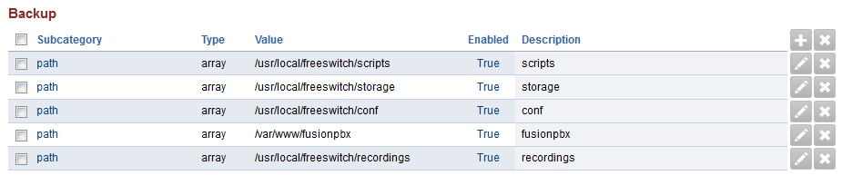
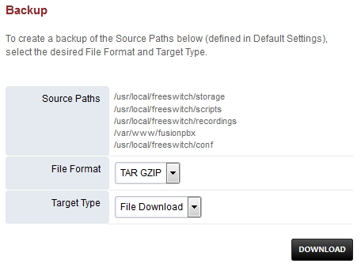
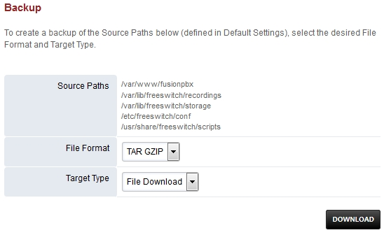

*****************
Backup
*****************

|

It's always good to have a backup method in place.  Here are the steps to a basic backup method with FusionPBX.

Command line settings
^^^^^^^^^^^^^^^^^^^^^^

Be sure to change the password by replacing the zzzzzzzz in PGPASSWORD="zzzzzzzz" with your password.

::
 
 
 cd /usr/src/fusionpbx-install.sh
 git pull
 cd debian/resources/backup/
 vim fusionpbx-backup.sh
 
 #!/bin/sh
 now=$(date +%Y-%m-%d)
 echo "Server Backup"
 export PGPASSWORD="zzzzzzzz"
 mkdir -p /var/backups/fusionpbx/postgresql
 #delete postgres logs older than 7 days
 find /var/log/postgresql/postgresql-9.4-main* -mtime +7 -exec rm {} \;
 #delete freeswitch logs older 3 days
 find /usr/local/freeswitch/log/freeswitch.log.* -mtime +2 -exec rm {} \;
 pg_dump --verbose -Fc --host=$database_host --port=$database_port -U fusionpbx fusionpbx --schema=public -f /var/backups/fusionpbx/postgresql/fusionpbx_pgsql_$now.sql
 echo "Backup Complete";
 
To save the file press escape then :wq for write and quite

You should have the script ready to execute. (Default the script will use FreeSWITCH package paths.  If you have an older install using source be sure to change this by commenting the package line #22 and uncomment the source line #25.)
 
Crontab settings
^^^^^^^^^^^^^^^^^

Setting crontab -e
 
::

 crontab -e
 Choose 1 for nano
 Goto the last blank line and paste in the next line.
 0 0 * * * bash /etc/cron.daily/fusionpbx-backup.sh
 press enter then save and exit.
 
 cd /usr/src/fusionpbx-install.sh/debian/resources/backup/
 cp fusionpbx-backup.sh /etc/cron.daily
 chmod 755 fusionpbx-backup.sh

Once this is complete you will have the backup ready to execute by ./fusionpbx-backup.sh or from the daily cron job. 

Gui settings
^^^^^^^^^^^^^

**From the Gui.**

**FreeSWITCH Package install paths.**

**Goto Advanced > Default Settings.**

::

 Settings for FreeSWITCH package backup paths.
 
 path		array  /var/backups/fusionpbx/postgresql		True	postgresql
 path		array  /usr/share/freeswitch/scripts			True 	scripts
 path		array  /var/www/fusionpbx	             	 	True 	fusionpbx
 path		array  /var/lib/freeswitch/storage	          	True 	storage
 path		array  /var/lib/freeswitch/recordings			True 	recordings
 path		array  /etc/freeswitch/conf 				True 	conf 
 
 Click "Reload" at the top of the page.

**FreeSWITCH Source install paths.**

:: 
 
 Settings for FreeSWITCH source backup paths.
 
 path           array   /var/backups/fusionpbx/postgresql       True    postgresql
 path		array  	/usr/local/freeswitch/scripts 		True 	scripts  	 	
 path		array  	/usr/local/freeswitch/recordings 	True 	recordings  	
 path		array  	/var/www/fusionpbx 		        True 	fusionpbx  	
 path		array  	/usr/local/freeswitch/conf	        True 	conf  	
 path		array  	/usr/local/freeswitch/storage 		True 	storage
 
 Click "Reload" at the top of the page.

Download Backups
^^^^^^^^^^^^^^^^^

From Advanced > Backup you can download the backup also. 

**FreeSWITCH Source install paths.**

**FreeSWITCH Package install paths.**

