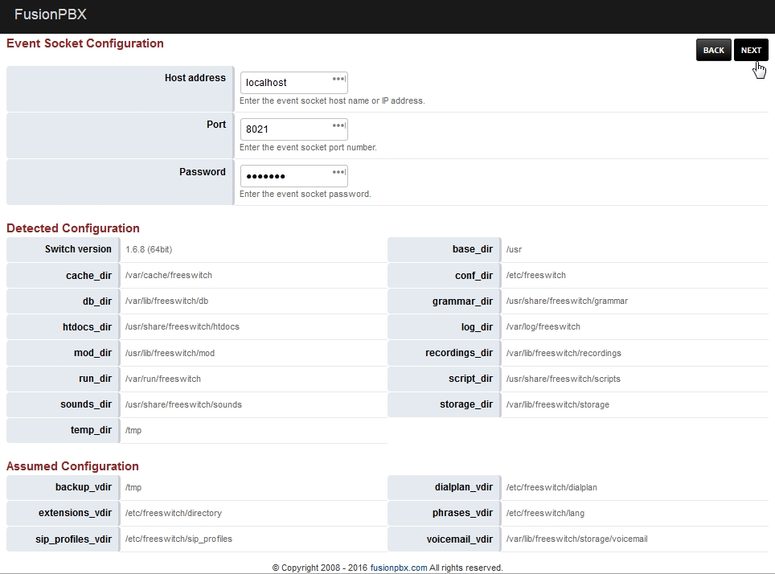
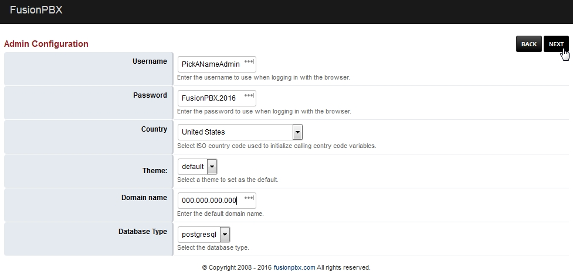
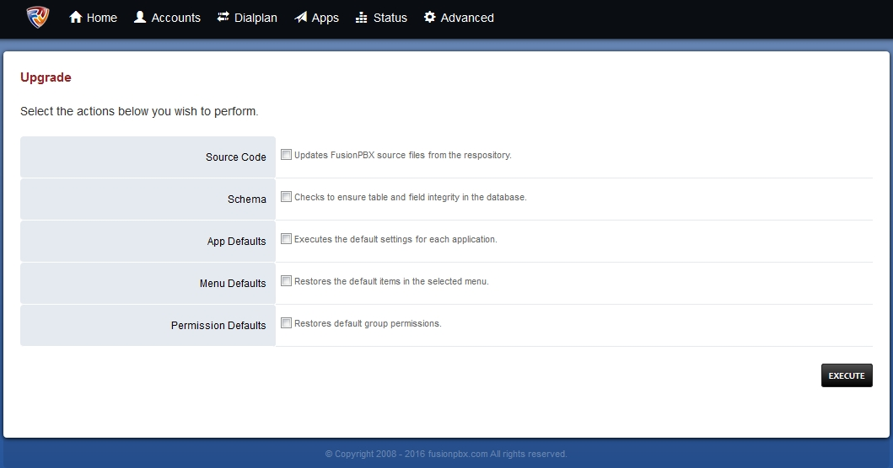
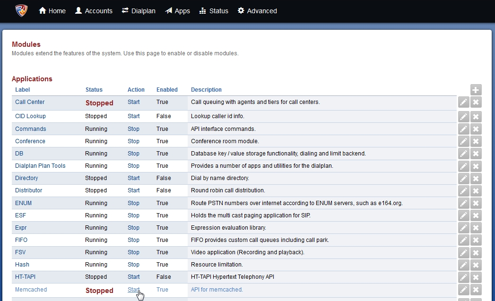

#################
New Install
#################
.. image:: ../_static/images/logo_right.png
        :scale: 85% 

Welcome to the FUSIONPBX getting started guide.  In this section we will show how to install FUSIONPBX.  FUSIONPBX can be used on multiple different operating systems, databases, and web servers.  In this guide we will show on Debian 8 (Jessie), Postgresql and NGINX.  **Please note to have a clean install.  The install script will install everthing but the Operating System**
    
    
**1.** Goto a console and follow the recomended steps from http://fusionpbx.com/download.php for a standard installation.  Some installations require special considerations.  Visit https://github.com/fusionpbx/fusionpbx-install.sh readme section for more details.

This install script is designed to be an fast, simple, and in a modular way to install FusionPBX. Start with a minimal install of Debian 8 with SSH enabled. Run the following commands under root. The script installs FusionPBX, FreeSWITCH release package and its dependencies, IPTables, Fail2ban, NGINX, PHP FPM and PostgreSQL.

Also, be sure to watch the youtube video from FreeSWITCH Cluecon Weekly https://www.youtube.com/embed/kejAxlYSW3o FusionPBX is installed and more!
     
::
     
  apt-get update && apt-get upgrade && apt-get install -y git
  cd /usr/src
  git clone https://github.com/fusionpbx/fusionpbx-install.sh.git
  chmod 755 -R /usr/src/fusionpbx-install.sh
  cd /usr/src/fusionpbx-install.sh/debian
  ./install.sh 
     
|

**2.** At the end of the install the script will instruct you to go to the ip address of the server in your web browser to finish the install. The script will also provide a secure random database password for you to use during the web based phase of the install. The install script builds the fusionpbx database so you will not need to use the create database username and password on the last page of the web based install.

After you have completed the install you can login with the GUI username and password you chose during the install. After you login, go to the menu and choose Advanced -> Upgrade select the checkbox for App defaults then execute. 
     

::

   PostgreSQL
   Database name: fusionpbx
   Database username: fusionpbx
   Database password: PasswordSuperSecureFusionPBX

   Complete the install by by going to the IP address of this server
   in your web browser or with a domain name for this server.
   https://000.000.000.000

*It can take between 2-10 minutes to install* (Depending on internet speed)

|

**3.** Goto a web browser and enter the ip address
    ::
     
     Now you'll need to manually finish the install and come back
     This way I can finish up the last bit of permissions issues
     Just go to
     https://000.000.000.000
     MAKE SURE YOU CHOOSE PostgreSQL as your Database on the first page!!!
     ON the Second Page:
     Database Name: fusionpbx
     Database Username: fusionpbx
     Database Password: generated_password
     Create Database Username: Leave_Blank
     Create Database Password: Leave_Blank
 
|

     
**4.** Web browser Installation part
    Select Language **Pick your language. Click next**
    
    .. image:: ../_static/images/install_lang_new.jpg
        :scale: 85%

|

Freeswitch Detect **Detecting folder paths used**
    

**Don't change anything here**
    
|

Database Configuration **Click Next**

     
     
|

Admin Login Configuration **Click Next**

.. image:: ../_static/images/install_admin_username_new.jpg
        :scale: 85% 
     
This will create the superadmin login that will be used in your web browser.

|

Install Finished  **Login with the username and password you choose during the install**
     
     
.. image:: ../_static/images/ilogin.jpg
        :scale: 80%
      
    

|

Run App defaults

::

  Go to the menu and choose Advanced -> Upgrade select the checkbox for App defaults then execute.
  

|

Start Sip Profiles

::

  Go to Status -> SIP Status and start the SIP profiles

.. image:: ../_static/images/fusionpbx_sip_status.jpg
        :scale: 85%

|

Start Memcached

::

    Go to Advanced -> Modules and find the module Memcached and click start.
    

        
|

**Note**: To display the logo at the top and not in the menu

::

  go to advanced -> default settings >  menu_style >  set to inline

