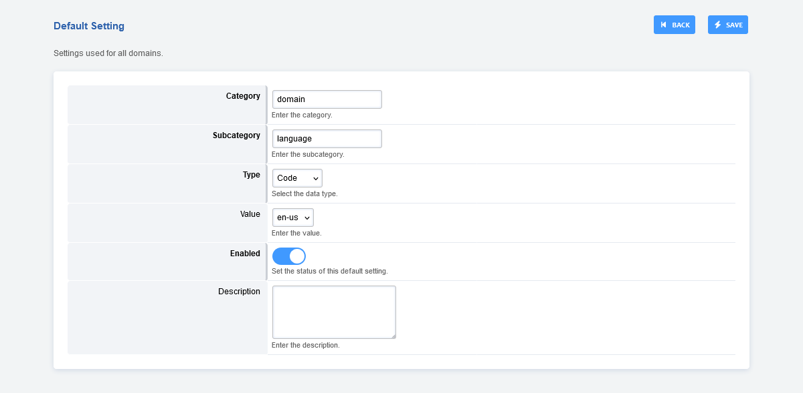
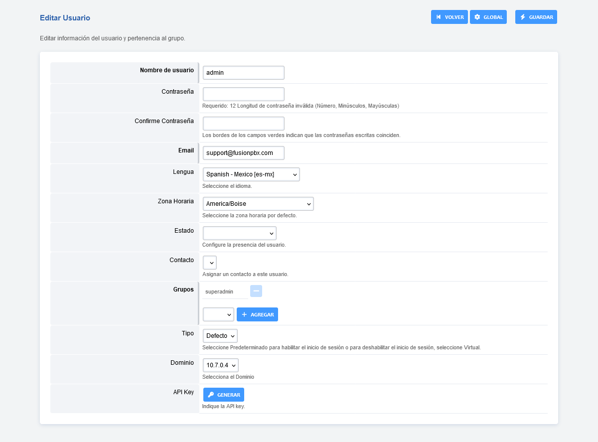

# Languages

FusionPBX has multilingual capabilities. This will allow for different
languages to be used in your FusionPBX installation. Languages can be
set globally, per tenant and per user. In addition to your FusionPBX
installation web interface, there are options to upload audio files for
FreeSWITCH to use via command line.

## Fusionpbx Settings

### Global

**Advanced \> Default Settings**

Setting the language from here will set the language for the entire
FusionPBX installation.

### Domain (Tenant)

**Advanced \> Domains** then click the plus at the bottom right and fill
in the required fields.

Setting the language from here will set the language for the entire
domain (tenant) in your FusionPBX installation. This can override the
Global language settings.

### User

**Accounts \> Users** then edit the user.

Setting the language from here will set the language for this specific
user and will override Global and Domain language settings.

## FreeSWITCH Sound Files

FreeSWITCH sound files location are dependent on operating system and
installation method.

### **Package Install**

-   Most if not all recent installations of FusionPBX are using packages
    for FreeSWITCH.
-   **File system location:**

<!-- -->

    /usr/share/freeswitch/sounds/en/us/

### **Source Install**

-   Older installs, custom installs, or personal preference are using
    source compiled versions.
-   **File system location:**

<!-- -->

    /usr/local/freeswitch/sounds/en/us/

### **Where to get language sounds**

-   **Free:**
    <https://freeswitch.org/stash/projects/FS/repos/freeswitch-sounds/browse>

## app_languages.php

**Guidelines** The words used in the text variable name

-   separated with a dash.
-   begin with a prefix
-   are lower case

**Prefixes**

-   **title:** The title of the page
-   **header:** The header of the page
-   **description:** Information to describe the page or an item on the
    page
-   **button:** The label for the buttons
-   **confirm:** A message used to confirm and action like delete
-   **message:** The response after an action is taken
-   **label:** The label for items on the page
-   **option:** The options in an html select box

**Languages**

Each word, phrase, or sentence has the language declared with the 2
language code with s dash seperating the region. There is one difference
the region is entirely in lower case. For additional information see the
following.

<http://www.w3.org/International/articles/language-tags/>

<http://www.iana.org/assignments/language-subtag-registry>

-   en-us
-   es-mx
-   de-ch
-   de-at
-   fr-ca
-   fr-ch
-   pt-pt
-   pt-br

**Example File**

An excerpt from the app_languages.php for Conference Center.

    <?php

       $text['title-conference-center']['en-us'] = 'Conference Center';
       $text['title-conference-center']['pt-pt'] = '';

       $text['header-conference-center']['en-us'] = 'Conference Center';
       $text['header-conference-center']['pt-pt'] = '';

       $text['description-conference-center']['en-us'] = 'Conference Center is used to setup one or more conference rooms with a name, extension number, a required pin number length, and a description.';
       $text['description-conference-center']['pt-pt'] = '';

       $text['label-name']['en-us'] = 'Name';
       $text['label-name']['pt-pt'] = '';

       $text['label-extension']['en-us'] = 'Extension';
       $text['label-extension']['pt-pt'] = '';

       $text['label-delete']['en-us'] = 'Delete';
       $text['label-delete']['pt-pt'] = '';

       $text['label-edit']['en-us'] = 'Edit';
       $text['label-edit']['pt-pt'] = '';

       $text['button-view']['en-us'] = 'View';
       $text['button-view']['pt-pt'] = '';

       $text['button-back']['en-us'] = 'Back';
       $text['button-back']['pt-pt'] = 'Voltar';

       $text['confirm-update']['en-us'] = 'Update Complete';
       $text['confirm-update']['pt-pt'] = 'Actualização Completa';

       $text['confirm-delete']['en-us'] = 'Do you really want to delete this?';
       $text['confirm-delete']['pt-pt'] = '';

       $text['button-add']['en-us'] = 'Add';
       $text['button-add']['pt-pt'] = '';

       $text['button-save']['en-us'] = 'Save';
       $text['button-save']['pt-pt'] = 'Guardar';

    ?>

To use inside the code on each page that displays text. Place the following code at the top just after the permision_exists

    //add multi-lingual support
       require_once "app_languages.php";
       foreach($text as $key => $value) {
           $text[$key] = $value[$_SESSION['domain']['language']['code']];
       }

To place a word, phrase or sentence it would be used in the code like
the following example.

    echo "<td align='left' width='30%' nowrap='nowrap'><b>".$text['title-conference-centers']."</b></td>\n";

An additional example.

    echo " <tr>\n";
    echo "     <td align='left' colspan='2'>\n";
    echo "         ".$text['description-conference-centers']."\n";
    echo "     </td>\n";
    echo " </tr>\n";
    echo "</table>\n";
