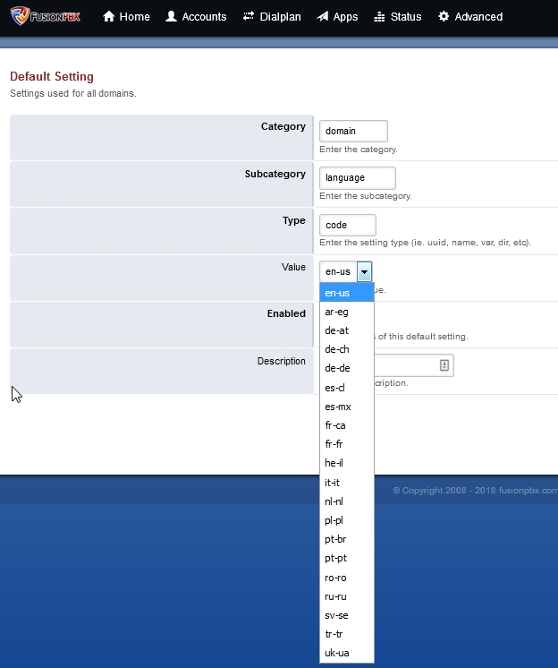
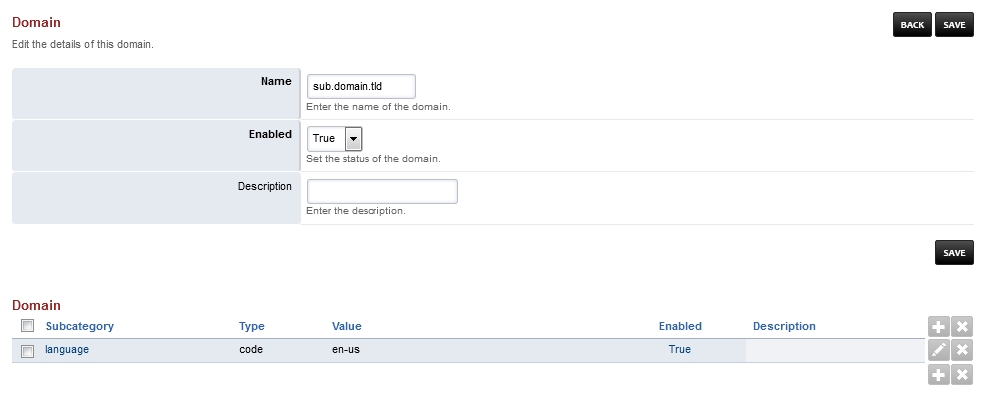
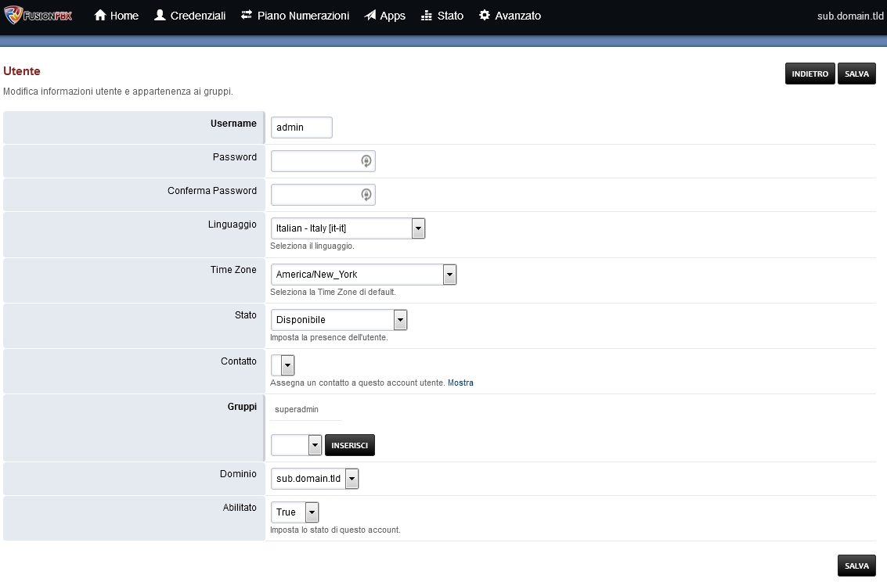

***************
Languages
***************

FusionPBX has multilingual capabilities.  This will allow for different languages to be used in your FusionPBX installation.  Languages can be set globally, per tenant and per user. In addition to the installation web interface, there are options to upload audio files for FreeSWITCH to use via command line.

Fusionpbx Settings
^^^^^^^^^^^^^^^^^^^

Global
--------

**Advanced > Default Settings**

Setting the language from here will set the language for the entire FusionPBX installation.

Domain (Tenant)
-------------------

**Advanced > Domains** then click the plus at the bottom right and fill in the required fields.

Setting the language from here will set the language for the entire domain (tenant) in your FusionPBX installation. This can override the Global language settings.

User
------

**Accounts > Users** then edit the user.

Setting the language from here will set the language for this specific user and will override Global and Domain language settings.

FreeSWITCH Audio Files  
^^^^^^^^^^^^^^^^^^^^^^^

