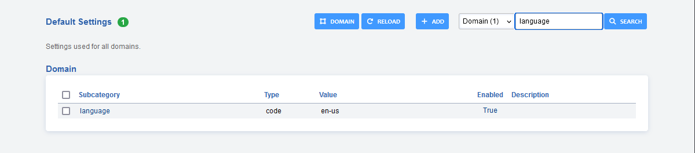
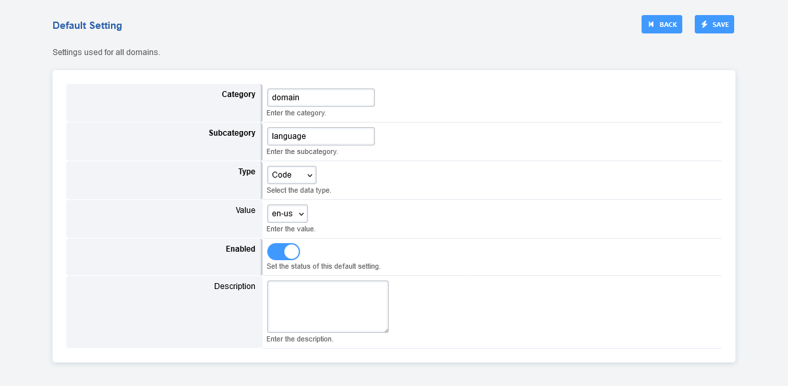
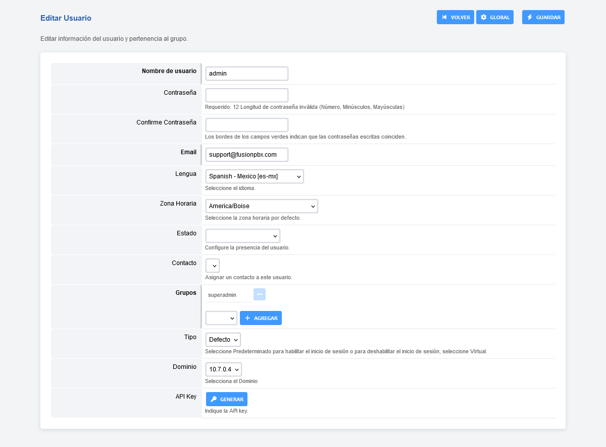

***************
Languages
***************

FusionPBX has multilingual capabilities.  This will allow for different languages to be used in your FusionPBX installation.  Languages can be set globally, per tenant and per user. In addition to your FusionPBX installation web interface, there are options to upload audio files for FreeSWITCH to use via command line.

Fusionpbx Settings
^^^^^^^^^^^^^^^^^^^

Global
--------

**Advanced > Default Settings**

Setting the language from here will set the language for the entire FusionPBX installation.

Domain (Tenant)
-------------------

**Advanced > Domains** then click the plus at the bottom right and fill in the required fields.

Setting the language from here will set the language for the entire domain (tenant) in your FusionPBX installation. This can override the Global language settings.

User
------

**Accounts > Users** then edit the user.

Setting the language from here will set the language for this specific user and will override Global and Domain language settings.

FreeSWITCH Sound Files  
^^^^^^^^^^^^^^^^^^^^^^^

FreeSWITCH sound files location are dependent on operating system and installation method.

**Package Install**
-----------------------

* Most if not all recent installations of FusionPBX are using packages for FreeSWITCH.

* **File system location:** 

::

 /usr/share/freeswitch/sounds/en/us/

**Source Install**
--------------------

* Older installs, custom installs, or personal preference are using source compiled versions.

* **File system location:**

::

 /usr/local/freeswitch/sounds/en/us/

**Where to get language sounds**
----------------------------------

* **Free:** https://freeswitch.org/stash/projects/FS/repos/freeswitch-sounds/browse

app_languages.php
^^^^^^^^^^^^^^^^^^^

**Guidelines**
The words used in the text variable name 

* separated with a dash.
* begin with a prefix
* are lower case

**Prefixes**

* **title:** The title of the page
* **header:** The header of the page
* **description:** Information to describe the page or an item on the page
* **button:** The label for the buttons
* **confirm:** A message used to confirm and action like delete
* **message:** The response after an action is taken
* **label:** The label for items on the page
* **option:** The options in an html select box

**Languages**

Each word, phrase, or sentence has the language declared with the 2 language code with s dash seperating the region. There is one difference the region is entirely in lower case. For additional information see the following.

http://www.w3.org/International/articles/language-tags/

http://www.iana.org/assignments/language-subtag-registry

* en-us
* es-mx
* de-ch
* de-at
* fr-ca
* fr-ch
* pt-pt
* pt-br

**Example File**

An excerpt from the app_languages.php for Conference Center.

::

 <?php

 	$text['title-conference-center']['en-us'] = 'Conference Center';
 	$text['title-conference-center']['pt-pt'] = '';
 
 	$text['header-conference-center']['en-us'] = 'Conference Center';
 	$text['header-conference-center']['pt-pt'] = '';
 
 	$text['description-conference-center']['en-us'] = 'Conference Center is used to setup one or more conference rooms with a name, extension number, a required pin number length, and a description.';
 	$text['description-conference-center']['pt-pt'] = '';
 
 	$text['label-name']['en-us'] = 'Name';
 	$text['label-name']['pt-pt'] = '';
 
 	$text['label-extension']['en-us'] = 'Extension';
 	$text['label-extension']['pt-pt'] = '';
 
 	$text['label-delete']['en-us'] = 'Delete';
 	$text['label-delete']['pt-pt'] = '';
 
 	$text['label-edit']['en-us'] = 'Edit';
 	$text['label-edit']['pt-pt'] = '';
 
 	$text['button-view']['en-us'] = 'View';
 	$text['button-view']['pt-pt'] = '';
 
 	$text['button-back']['en-us'] = 'Back';
 	$text['button-back']['pt-pt'] = 'Voltar';
 
 	$text['confirm-update']['en-us'] = 'Update Complete';
 	$text['confirm-update']['pt-pt'] = 'Actualização Completa';
 
 	$text['confirm-delete']['en-us'] = 'Do you really want to delete this?';
 	$text['confirm-delete']['pt-pt'] = '';
 
 	$text['button-add']['en-us'] = 'Add';
 	$text['button-add']['pt-pt'] = '';
 
 	$text['button-save']['en-us'] = 'Save';
 	$text['button-save']['pt-pt'] = 'Guardar';
 
 ?>

To use inside the code on each page that displays text. Place the following code at the top just after the permision_exists

::

 //add multi-lingual support
 	require_once "app_languages.php";
 	foreach($text as $key => $value) {
 		$text[$key] = $value[$_SESSION['domain']['language']['code']];
 	}

To place a word, phrase or sentence it would be used in the code like the following example.

::

 echo "<td align='left' width='30%' nowrap='nowrap'><b>".$text['title-conference-centers']."</b></td>\n";

An additional example.

::

 echo "	<tr>\n";
 echo "		<td align='left' colspan='2'>\n";
 echo "			".$text['description-conference-centers']."\n";
 echo "		</td>\n";
 echo "	</tr>\n";
 echo "</table>\n";

