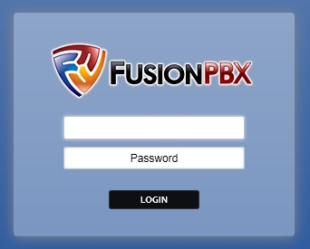

*************
Quick Install
*************
.. image:: ../_static/images/logo_right.png
        :scale: 85%

|

Welcome to the FusionPBX installation guide.

|

FusionPBX can be installed on several different operating systems. However this guide assumes you are starting with a **minimal** install of Debian 9 with SSH enabled. This install has been designed to be fast, simple and modular, and generally takes 5 minutes or less. Installation times depend on factors like CPU, RAM, disk I/O and bandwidth. Install Video https://youtu.be/YmIht8hEHYU

.. raw:: html

    

    <iframe width="100%" height="350" src="https://www.youtube.com/embed/YmIht8hEHYU?rel=0" frameborder="0" ; encrypted-media" allowfullscreen></iframe>
    

**1.** Run the following commands as root. The script installs FusionPBX, FreeSWITCH release package and its dependencies, iptables, Fail2ban, NGINX, PHP-FPM and PostgreSQL.

Start with a **minimal** install of Debian 9 with SSH enabled.
Paste the following commands in the console window **one line at a time**.

::

 wget -O - https://raw.githubusercontent.com/fusionpbx/fusionpbx-install.sh/master/debian/pre-install.sh | sh; 

|

::

 cd /usr/src/fusionpbx-install.sh/debian && ./install.sh
 
 |

If using **Debian on Proxmox LXC** containers please run the following **BEFORE** starting the FusionPBX install.

::

 apt-get update && apt-get upgrade
 apt-get install systemd
 apt-get install systemd-sysv
 apt-get install ca-certificates
 reboot

|

**2.** At the end of the install, the script will instruct you to go to the ip address of the server (or domain name) in your web browser to login. The script will also provide a username and secure random password for you to use. This can be changed after you login. The install script builds the fusionpbx database. If you need the database password it is located in /etc/fusionpbx/config.php .

::

   Installation has completed.

   Use a web browser to login.
      domain name: https://000.000.000.000
      username: admin
      password: zxP5yatwMxejKXd

   The domain name in the browser is used by default as part of the authentication.
   If you need to login to a different domain then use username@domain.
      username: admin@000.000.000.000

   Official FusionPBX Training
      Admin Training    24 - 26 Jan (3 Days)
      Advanced Training 31 Jan - Feb 2 (3 Days)
      Continuing Education Last Thursday Monthly (1 Day)
      Timezone: https://www.timeanddate.com/worldclock/usa/boise
      For more info visit https://www.fusionpbx.com/training.php

   Additional information.
      https://fusionpbx.com/support.php
      https://www.fusionpbx.com
      http://docs.fusionpbx.com
      https://www.fusionpbx.com/training.php

|

|

After the install script has completed go to your web browser and login with the information provided by the install script.

After the installation script finishes, the option for anything to register to the ip address is **ENABLED**.

* If you plan on registering devices to the FusionPBX ip address then no further action is required.

It is however recommended to register to a domain name (FQDN) since most scripted attacks happen to the public ip. Registering to the ip address will be blocked by the fail2ban rules freeswitch-ip and auth-challenge once these rules are set to true.

* To help secure your FusionPBX installation, enable the `fail2ban rules <http://docs.fusionpbx.com/en/latest/firewall/fail2ban.html>`_ [freeswitch-ip] and [auth-challenge-ip] in /etc/fail2ban/jail.local.

::

 [freeswitch-ip]
 enabled  = true

::

 [auth-challenge-ip]
 enabled  = true
