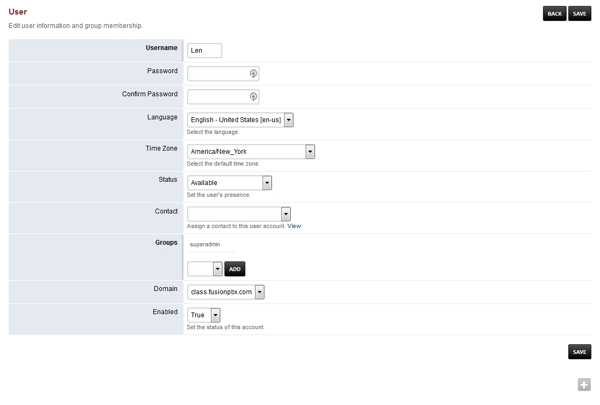

####################
Account Settings
####################

* **User Name:** The user name.
* **Password:** The password.
* **Confirm Password:** Must match the password.
* **Language:** Choose a language for the user.
* **Time Zone:** Time zone specific to the user.
* **Status:** Used for call center and operator panel.
* **Contact:** The users contact.  Is used in a phone directory or Apps > Contacts.
* **Groups:** Group the user is in and relates to what the user can see and do in the menus.
* **Domain:**  Domain specific to the user.
* **Enabled:** Enable or disable the account.

Time zone can be set per user but it can also be set in Menu -> Advanced -> Default Settings.
