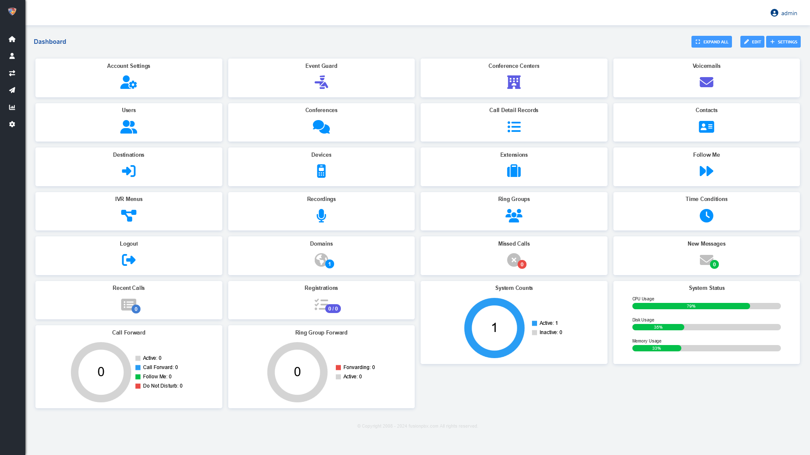

############
Dashboard
############

Quickly access information and tools related to your account.  Depending on the user permissions, the user may see less options on this screen.

* **Voicemail:** New and total voicemails related to the users voicemail box.  A user can be assigned to more than 1 voicemail box.
* **Missed Calls:** Missed calls for the user.
* **Recent Calls:** Number of calls in the last 24 hours.
* **System Status:** Disk usage in percentage, FusionPBX version, FreeSWITCH version, FreeSWITCH uptime, OS Uptime, CPU Usage, DB Connections, Channels and Registrations.
* **Call Routing:**  See if call forward, follow me, do not disturb is set and a quick wat to edit those options if needed.
* **Ring Group Forward:** See the name, extension number, if forwarding is enabled and what number it is forwarded to.
* **System Counts:** Number of Domains, Devices, Extensions, Gateways, Users, Destinations, CC Queues, IVR Menus, Ring Groups, Voicemail and if they are disabled.

`Dashboard Default Settings`_
---------------------------------------

.. _Dashboard Default Settings: /en/latest/advanced/default_settings.html#id5

##Move the FusionPBX v5.3 Menu Bar to the Top

By default, the new version of FusionPBX has the menu bar on the left side of the screen. You can move the menu bar to the top of the screen with these directions. 
Log in to the FusionPBX Admin Interface.
Go to Advanced > Default Settings.
In the filter at the top, search for "Theme."
Find the Menu_Style setting and change it to Fixed.
Save your changes and click Reload at the top of the Default Settings screen.
Refresh your FusionPBX interface, and the menu bar should now be at the top.
