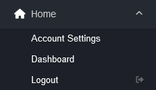
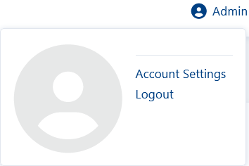

#######
Logout
#######

Logout is under **Home** in the menu dropdown. 

Logging out could be necessary after an upgrade or settings change that requires a new session.

Alternatively, you can logout through the user icon located on the top right corner.

A logout button can also be added to the top right corner by setting **logout_icon_visible** as true in default settings

