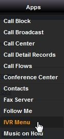
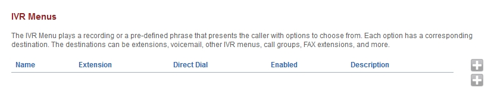
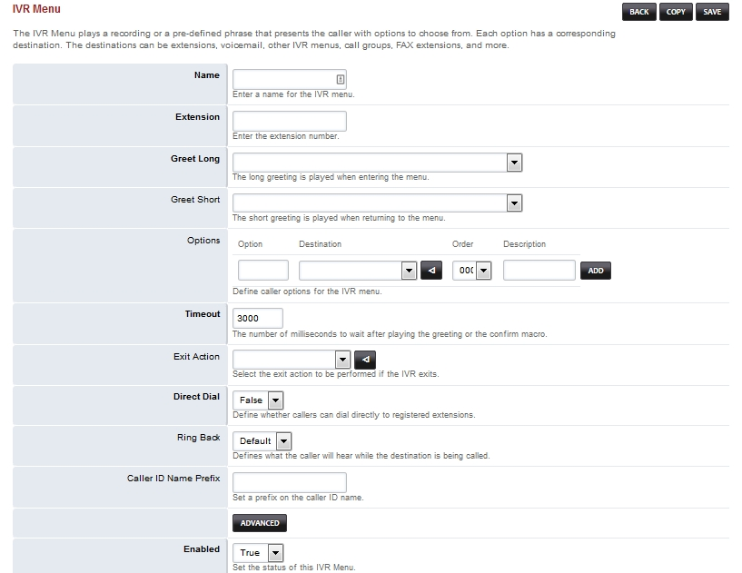
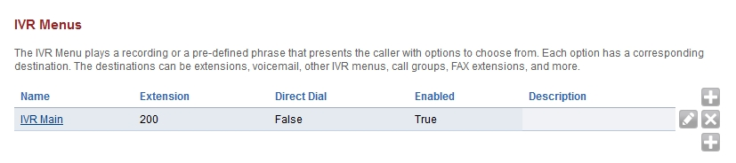

****
Apps
****

Call Block
----------

A list of numbers from which to block calls. 

Call Broadcast
--------------

Call Broadcast 

Call Center
-----------

List of queues for the call center. 

Call Detail Records
-------------------

Call Detail Records (CDRs) are detailed information on the calls. Use the fields to filter the information for the specific call records that are desired. Then view the calls in the list or download them as comma seperated file by using the 'csv' button.  

Call Flows
------------

Direct calls between two destinations by calling a feature code. 

Conference Center
-----------------

Conference Centers are a group of conference rooms. They can be organized by cost center, geographically, or other criteria. 

Contacts
--------

The contact is a list of individuals and organizations. 

Fax Server
----------

To receive a FAX setup a fax extension and then direct the incoming to it.  

Follow Me
----------

Use the links to configure call forward follow me, or do not disturb. The following list the extensions that have been assigned to this user account. 

IVR Menu
--------

Welcome to the adding IVR section.  Here you will find how to add IVR's.

|

Click on **Apps** then **IVR Menu**

|
|

Then click the

 .. image:: ../_static/images/plus.png
        :scale: 85%

on the right. 

|
|

|
|

.. image:: ../_static/images/fusionpbx_ivr3.jpg
        :scale: 85%

|
|

|

Music On Hold
--------------

Music on hold can be in WAV or MP3 format. To play an MP3 file you must have mod_shout enabled on the 'Modules' tab. You can adjust the volume of the MP3 audio from the 'Settings' tab. For best performance upload 16 bit, 8/16/32/48 kHz mono WAV files. 

Operator Panel
---------------

Virtually control extensions AVAILABLE, ON BREAK, DO NOT DISTURB and LOGOUT state.  Drag and drop funcionality to transfer calls to Other Extensions.

Phrases
--------

Create phrases of audio files to be played in sequence. 

Ring Groups
-----------

A ring group is a set of destinations that can be called with a ring strategy. 

Recordings
----------

Dial *732 to create a recording, or (for best results) upload a 16bit 8khz/16khz mono WAV file. 

Time Conditions
---------------

Dynamically route calls to an IVR menu, external numbers, scripts, or other destinations based on time conditions. 

Queues
------

Queues are used to setup waiting lines for callers. Also known as FIFO Queues. 

Voicemail
---------

Voicemail Settings 

