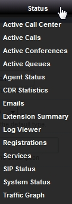

#########
Status
#########

| In the **Status** menu you have the options for **Active Call Center, Active Calls, Active Conferences, Active Queues, Agent Status, CDR Statistics, Emails, Extension Summary, Log Viewer, Registrations, Services, SIP Status, System Status and Traffic Graph.

        
        

.. toctree::
  :maxdepth: 3
  :glob:

  manual/status.rst
