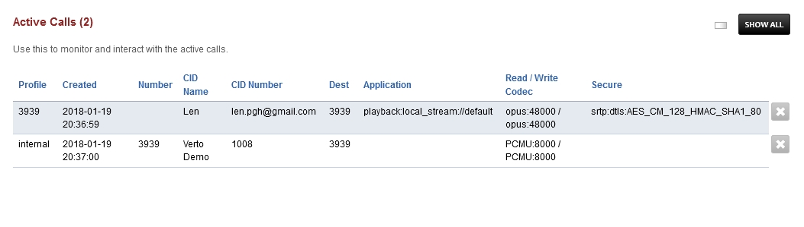

##############
Active Calls
##############

Use this to monitor and interact with the active calls.

Here you can view the sip profile used, time the call was created, number, cid number, destination, application, Codecs used, and if the call is secure (encrypted)

*  Click the X to end the call
*  Click the Show All button to show calls in all domains.

