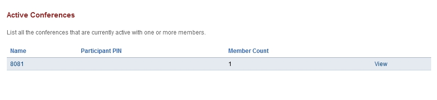
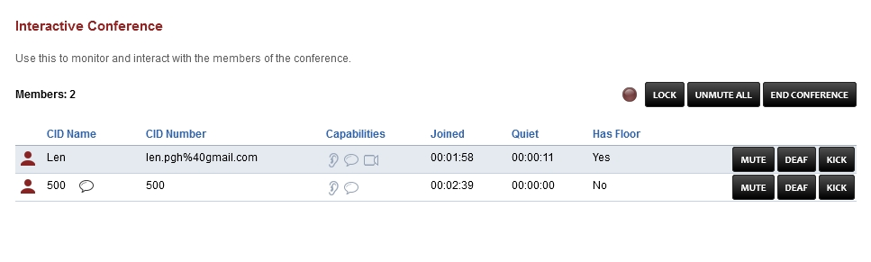

####################
Active Conferences
####################

List all the conferences that are currently active with one or more members.

* Click view to view the active conference.

* **Red ball icon:** If illuminated the conference is being recorded.
* **Lock:** Can lock the conference from anyone else joining.
* **Unmute All:** Unmute all the members.
* **End Conference:** End the conference.

* **CID Name:** Caller ID Name
* **CID Number:** Caller ID Number
* **Capabilities:** Icons show what capabilities each member have like hear/mute, talking, and video.
* **Joined:** How long ago the member joined.
* **Quiet:** How long since the member was talking last.
* **Has Floor:**  Who is currently talking.

* **Mute:** Mute a member.
* **Dead:** Make it so the member can't hear what is being said in the conference.
* **Kick:** Kick the member from the conference.
