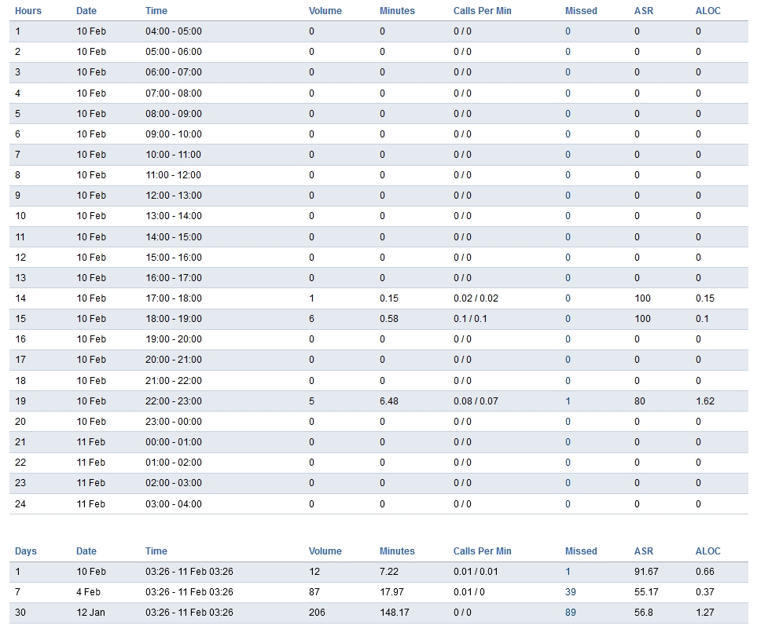

************
CDR Statistics
************

Call Detail Records Statics summarize the call information.

.. image:: ../_static/images/Status/cdr_statistics/fusionpbx_call_detail_record_statistics.jpg
        :scale: 85%

Definitions
^^^^^^^^^^^

* Hours: Specific hour in that day.
* Date: Specific date in that month.
* Time: Specific time in that day.
* Volume: Number of calls.
* Minutes: Specific number of minutes.
* Calls Per Minute: Specific number of calls per minute.
* Missed: Specific number of missed calls.
* ASR: The answer to seizure ratio. Which is how many calls where answered versus not answered.
* Aloc:  ALOC is the average length of call.
* Days: Specific day in that month.
