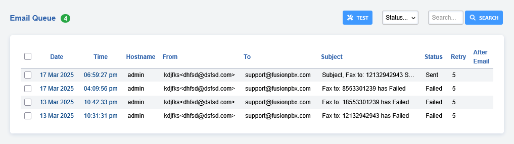

# Email Queue

Manage sending emails in a queue. Also works with the transcription of
audio files with IBM Watson, Azure, or Google.



## Install Instructions

:::{important}   
Make sure to [Upgrade](https://docs.fusionpbx.com/en/latest/advanced/upgrade.html#) to the latest FusionPBX version.   
:::   

-   Run the following commands to install as a service

```
    cp /var/www/fusionpbx/app/email_queue/resources/service/debian.service /etc/systemd/system/email_queue.service
    systemctl enable email_queue
    systemctl start email_queue
    systemctl daemon-reload
```

-   Or run as a cron job

```
    crontab -e
    * * * * * cd /var/www/fusionpbx && /usr/bin/php /var/www/fusionpbx/app/email_queue/resources/service/email_queue.php
```

:::{note}   
Be sure all **Email** category settings are configured properly within
Default Settings, or emails will fail to send properly.   
:::   
