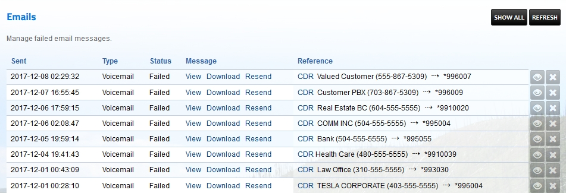

########
Emails
########

Manage failed email messages.  If for some reason the message doesn't get sent they will sit in a queue.  You can view, download or resend each message.

*  **Sent-** Date and time last attempt to email was made
*  **Type-** If the email was a missed call or voicemail
*  **Status-** Status of the email
*  **Message-** View, Download or Resend the email
*  **Reference-** CDR information
*  **Eye icon-** More details about the email
*  **X icon-**  Deletes the email
