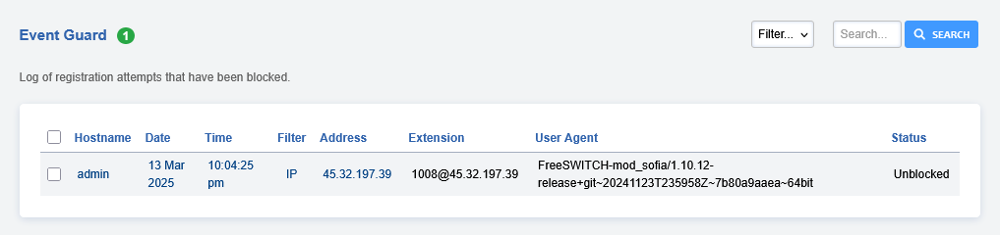

## Event Guard

This is an optional service designed to protect your VoIP server. It observes registration events    
and blocks those that abuse it. 

:::{note}   
It doesn't watch server logs.   
:::   

This feature currently supports iptables and pf firewalls. 
Netfilter firwall support will be added in the future.

It logs blocked and unblocked calls to Event Guard.
Event guard currently uses the Access Control allowed nodes as a
white list. Can add a new Access Control List called Customers or any
name you like set to default deny, then add the customer CIDR to a new
node set as allowed.

Event guard also looks at the current allowed IP addresses and trusts
these registered IP addresses that were authenticated.



### Install Instructions

:::{important}   
Make sure to [Upgrade](https://docs.fusionpbx.com/en/latest/advanced/upgrade.html#) to the latest FusionPBX version.   
:::   

-   Run the following commands to install as a service

```
    cp /var/www/fusionpbx/app/event_guard/resources/service/debian.service /etc/systemd/system/event_guard.service
    systemctl enable event_guard
    systemctl start event_guard
    systemctl daemon-reload
```

- Or as a cron job

```
php /var/www/fusionpbx/app/event_guard/resources/service/event_guard.php >/dev/null 2>&1 &
```

### Unblock an IP Address

To unblock an address select the check box and then press the UNBLOCK
button on the top right.
