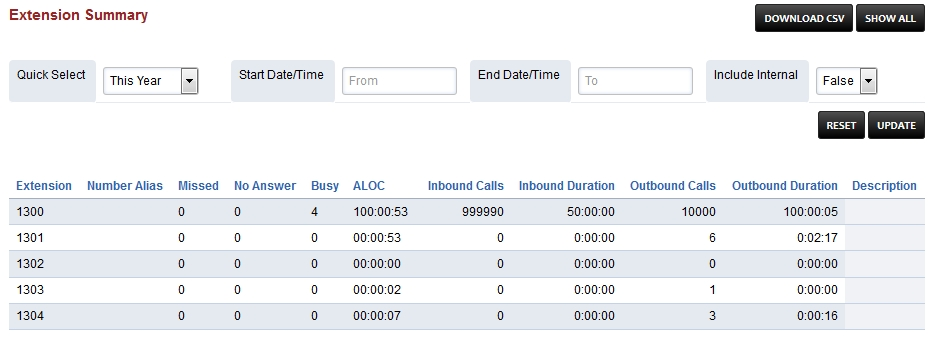

##################
Extension Summary
##################

Summary of extension activity per domain such as misssed calls, answered calls, no answer, inbound duration, outbound duration, number of outboud calls, number of inbound calls and Average length of Call (ALOC). The summarized information can be downloaded as a CSV file.

Definitions
^^^^^^^^^^^

* Extension: The extension number.
* Number Alias: Alias name for the extension number.
* Missed: Number of missed calls.
* No Answer: Number of calls not answered.
* Busy: Number of calss not answered wile busy.
* ALOC: The average length of call.
* Inbound Calls: Number of calls in.
* Inbound Duriation: Number of call minutes in. 
* Outbound Calls: Number of calls out.
* Outbound Duriation: Number of call minutes out.
