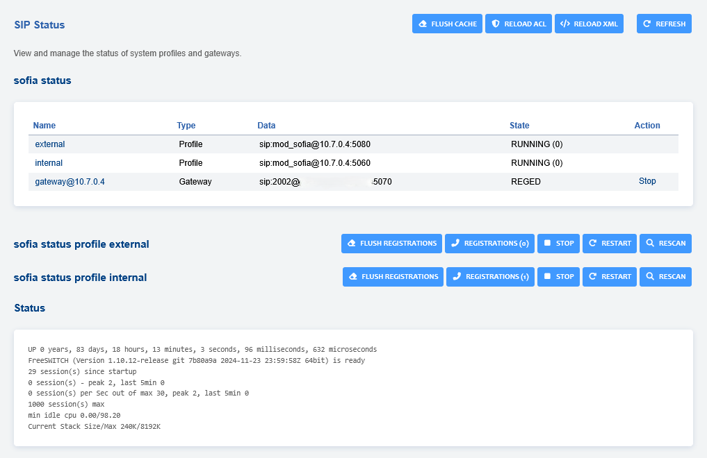

# SIP Status

This will show sofia status of internal, internal-ipv6, external, and
external-ipv6 profiles.

With profiles you can see

-   REGISTRATIONS
-   START/RESTART/RESCAN/FLUSH REGISTRATIONS
-   FLUSH CACHE
-   RELOAD ACL
-   RELOAD XML and REFRESH
-   View UP time, sessions since startup, max sessions, and current
    stack size/max.

