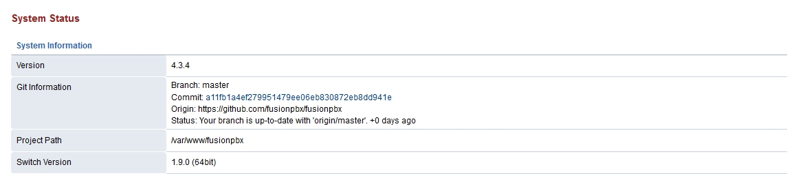
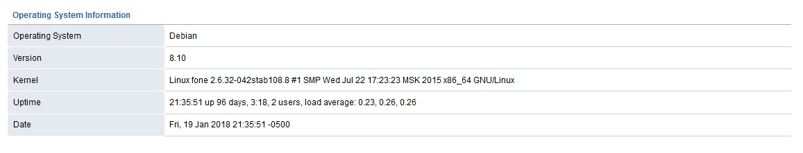
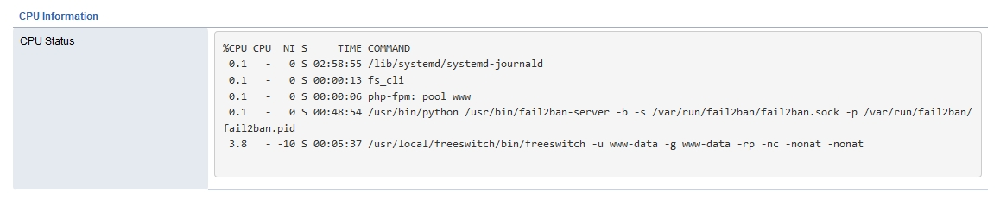
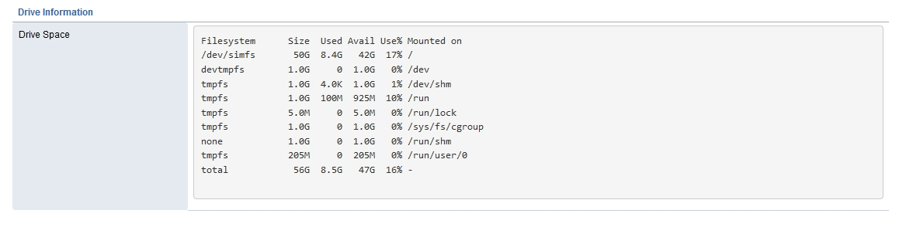
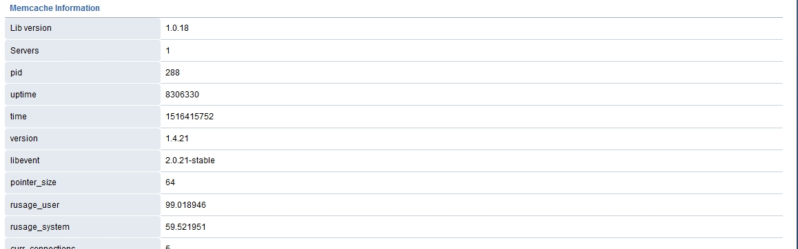

##############
System Status
##############

System Information, FusionPBX Version, Git Version, Switch Version, Memory Information, CPU Information, Hard Drive Information and Memcache Information.

